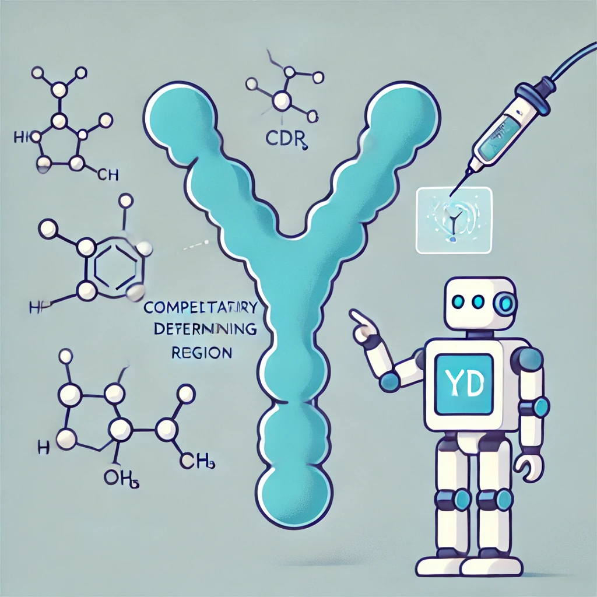
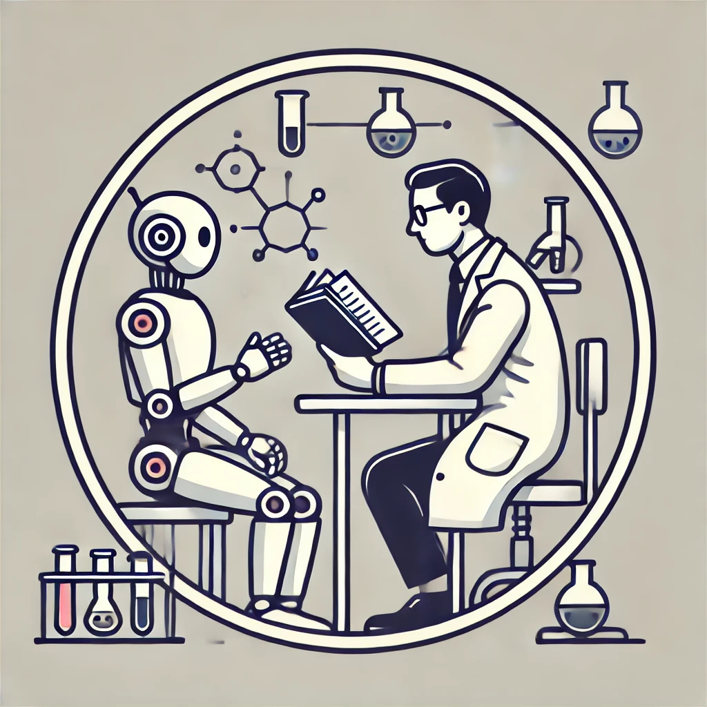

## To Brige the Gap Between Artificial Intelligence and the Real World Healthcare Challenges

Our group's long-term vision is to bridge the gap between artificial intelligence (AI) and human health. We advance machine learning to address real-world health challenge. Our research focuses on developing human-centered machine learning models that recognize patterns among diseases and develop therapies.

[**We are recruiting highly motivated Ph.D students and Postdoctoral fellow. See details!**](opportunities)
---

  
  
  

## Latest News

  <ul>
    <li><strong>Dec 2024:</strong> So honored to be featured in UTHealth Insider <a href="https://www.linkedin.com/feed/update/urn:li:activity:7274468512646017024/">news</a>.</li>
    <li><strong>Oct 2024:</strong> Awarded NIH Research Project Grant R01 as PI ($3.9M for five years) for data-driven disease subtyping for Alzheimer's disease.</li>
    <li><strong>Oct 2024:</strong> Gave a talk "AI for Computational Phenotyping and Predicting Accelerated Aging" at UTHealth Houston Neuroscience Research Center and Aging Research Symposium.</li>
    <li><strong>Jan 2024:</strong> Gave a talk "AI/ML to Identify Personalized Treatment Effect from Data" at Artificial Intelligence in Biomedicine and Healthcare Workshop by McWilliams School of Biomedical Informatics, UTHealth Houston.</li>
    <li><strong>Nov 2023:</strong> Awarded NIH Research Project Grant R01 as PI ($4M for five years) on federated learning for multiple clinical data.</li>
    <li><strong>Aug 2023:</strong> Our work, <a href="https://arxiv.org/abs/2304.10946">CancerGPT</a>, was invited for a talk at <a href="https://www.pathai.com">PathAI</a>.</li>
    <li><strong>May 2023:</strong> Gave an invited talk at <a href="https://www2023.thewebconf.org">The Web Conference 2023 Health Day</a>.</li>
    <li><strong>Mar 2023:</strong> Gave an invited talk at BERD Core, UTHealth McGovern Medical School, and Data Science Core at SBMI.</li>
    <li><strong>Mar 2023:</strong> Honored to serve as a grant review panelist for United Kingdom Research and Innovation.</li>
    <li><strong>Nov 2022:</strong> Served as a grant review panelist for AI in Healthcare (Fonds de recherche du Québec & Ministry of Innovation, Science & Technology - Israel).</li>
    <li><strong>Nov 2022:</strong> Gave a talk at <a href="https://www.aihealthconference.com">AI in Health Conference</a>, organized by Rice Ken Kennedy Institute.</li>
    <li><strong>Sep 2022:</strong> Our vaccine and Alzheimer's study was invited to testify before the U.S. Department of Health & Human Services.</li>
    <li><strong>Jan 2021:</strong> Top 10% most cited <i>PLoS One</i> article in 2016 <a href="http://journals.plos.org/plosone/article?id=10.1371/journal.pone.0159788">[paper]</a>.</li>
    <li><strong>Jul 2020:</strong> Selected as an AAIC 2020 Highlighted Poster.</li>
    <li><strong>Jul 2020:</strong> Our team's vaccine and Alzheimer's study was covered by <a href="https://www.npr.org/sections/health-shots/2020/07/27/894731147/flu-shot-and-pneumonia-vaccine-might-reduce-alzheimers-risk-research-shows">NPR</a>, <a href="https://www.cnn.com/2020/07/27/health/flu-pneumonia-shot-lowers-alzheimers-risk-wellness/index.html">CNN</a>, and <a href="https://www.sciencedaily.com/releases/2022/06/220624123814.htm">ScienceDaily</a>.</li>
    <li><strong>Apr 2020:</strong> Ranked 2nd in the International <a href="https://www.synapse.org/#!Synapse:syn20940518/wiki/596265">DREAM Challenge for Drug Repurposing</a>.</li>
    <li><strong>Jan 2020:</strong> Served as a grant review panelist for <a href="https://www.fnr.lu/international-cooperation/nsf/">Luxembourg National Science Foundation</a>.</li>
    <li><strong>Nov 2020:</strong> Gave a talk at <a href="https://www.aihealthconference.com">AI in Health Conference</a>, organized by Rice Ken Kennedy Institute.</li>
    <li><strong>Sep 2019:</strong> Initiated the <a href="https://sbmi.uth.edu/datathon/">SBMI Datathon Series</a> as an organizer.</li>
    <li><strong>Sep 2019:</strong> Awarded Robert Wood Johnson Foundation Health Data 4 Action grant as PI.</li>
  </ul>

  

