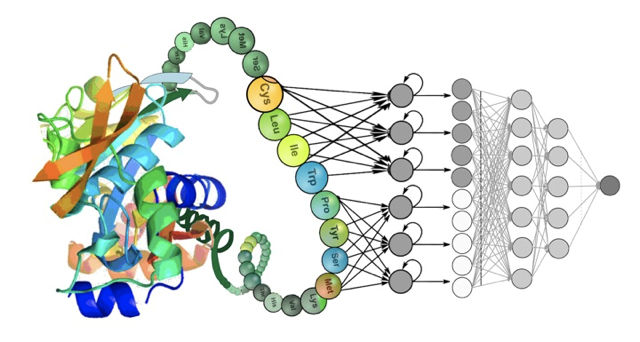

## Antibody affinity maturation using AI

\
source: [phys.org](https://phys.org/news/2022-04-deep-decode-functional-properties-proteins.html)

### AI-Driven Optimization of Antibody Binding Affinity  

Antibodies are essential molecules in both the immune system and therapeutic applications, binding to specific targets with high precision. A key challenge in antibody engineering is *affinity maturation*—enhancing an antibody’s binding strength to improve efficacy in diagnostics and therapeutics. Traditional methods, such as phage display, rely on iterative mutagenesis and selection, but these approaches are limited by the vast combinatorial search space of possible mutations and the constraints of experimental scalability.  

Our work integrates artificial intelligence (AI) with computational protein engineering to address these limitations. We evaluate multiple machine learning (ML) approaches for antibody affinity maturation, including **protein language models (PLMs)** (e.g., ESM, SaProt), **inverse folding algorithms** (e.g., ESM-IF, ProteinMPNN), and **diffusion-based generative models** (e.g., DiffAb). These models capture different aspects of antibody-antigen interactions: PLMs leverage sequence-based evolutionary information, inverse folding ensures structural integrity while mutating antibody residues, and diffusion models refine sequences based on probabilistic generation.  

To benchmark these AI models, we compile experimental binding affinity data from diverse antibody-antigen complexes, including datasets on anti-VEGF and influenza broadly neutralizing antibodies. We assess the correlation between AI-predicted likelihood scores and experimentally measured affinity, using metrics such as **FoldX ΔΔG**, **epitope surface area reduction**, and **ProteinMPNN negative log-likelihood (NLL)**. Additionally, we apply AI-driven mutational sampling to improve the binding of an influenza-targeting antibody (F45) against a new H1N1 antigen, validating the proposed mutations computationally before experimental testing.  

Our study systematically compares AI-driven strategies for optimizing antibody affinity, bridging computational predictions with real-world experimental validation. By refining ML-driven antibody design, we aim to accelerate therapeutic antibody discovery and improve precision in immunotherapy applications.