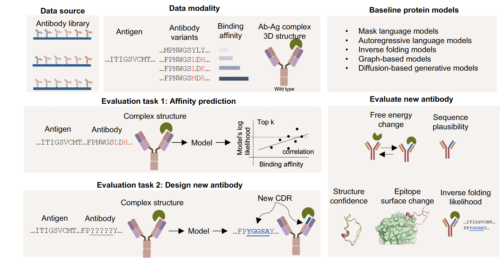

## Antibody affinity maturation using AI

Designing better antibodies is crucial for developing effective treatments for diseases like cancer, COVID-19, and the flu. Our team built a tool called AbBiBench to help researchers evaluate how well AI models can design antibodies that bind more tightly to their targets—similar to how a lock fits a key. Unlike older methods that only looked at the antibody itself, AbBiBench evaluates the full "lock-and-key" fit between the antibody and the disease target (called an antigen). We collected data from nearly 156,000 antibody variants across nine different diseases and tested 14 advanced AI models, including some that learn from protein structures. We found that models that “see” both the structure and sequence of proteins—especially those using a method called inverse folding—were best at predicting strong binders and even creating new, improved antibodies. In a case study, we used these models to design new antibodies against the H1N1 flu virus, and 18 of them are now being tested in the lab. This work could speed up the discovery of next-generation antibody treatments by combining biology and machine learning in smarter ways.

Reference: coming soon
