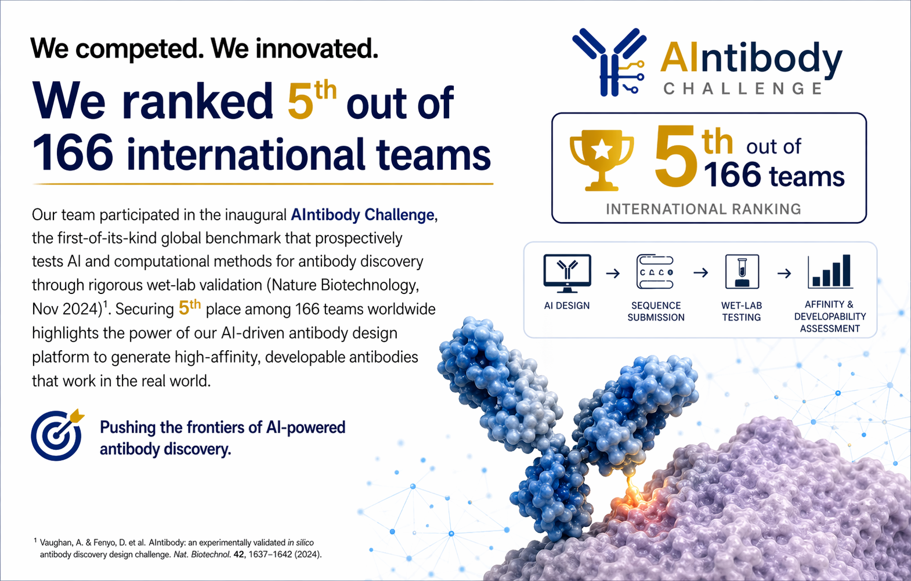
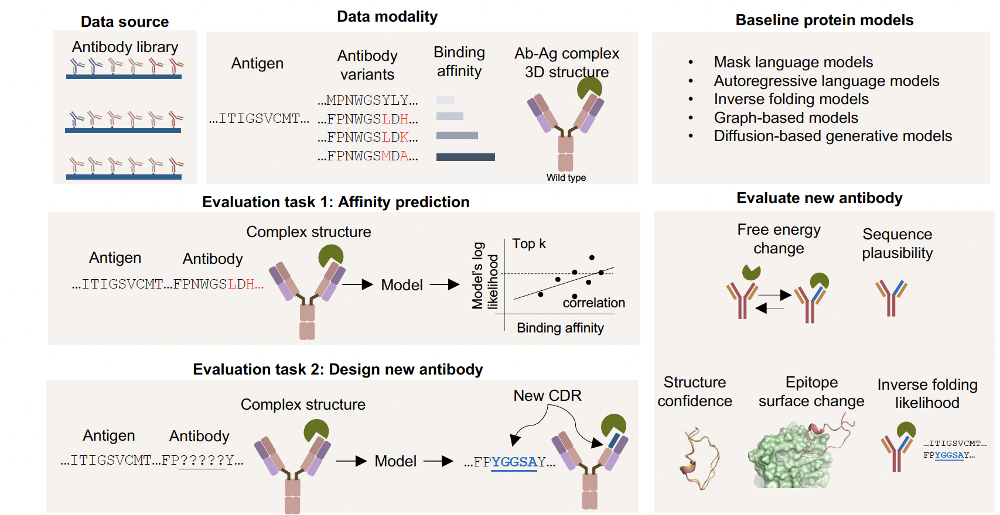
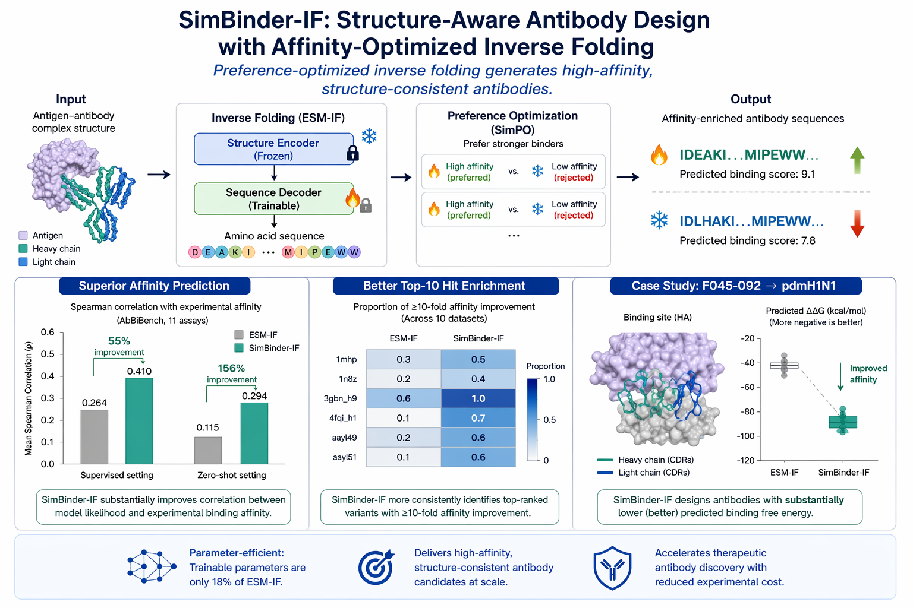

## AIntbody Challenge

Our lab participated in the inaugural AIntibody Challenge, a global benchmark designed to rigorously evaluate AI-driven antibody discovery through prospective, blinded experimental validation. Competing against 166 international teams, we ranked 5th—placing us among the top performers in a field pushing the boundaries of computational protein design. The challenge uniquely tests real-world impact by requiring submitted antibody sequences to be synthesized and experimentally assessed for affinity and developability, rather than relying on retrospective analysis. Our performance highlights the strength of our AI-based design platform in generating high-quality, functional antibodies under stringent conditions. This achievement underscores our commitment to advancing robust, experimentally validated AI solutions for next-generation therapeutic antibody discovery.

Reference: Erasmus, M.F., Spector, L., Ferrara, F. et al. AIntibody: an experimentally validated in silico antibody discovery design challenge. Nat Biotechnol 42, 1637–1642 (2024). https://doi.org/10.1038/s41587-024-02469-9

## Antibody affinity maturation benchmark 

Designing better antibodies is crucial for developing effective treatments for diseases like cancer, COVID-19, and the flu. Our team built a tool called AbBiBench to help researchers evaluate how well AI models can design antibodies that bind more tightly to their targets—similar to how a lock fits a key. Unlike older methods that only looked at the antibody itself, AbBiBench evaluates the full "lock-and-key" fit between the antibody and the disease target (called an antigen). We collected data from nearly 156,000 antibody variants across nine different diseases and tested 14 advanced AI models, including some that learn from protein structures. We found that models that “see” both the structure and sequence of proteins—especially those using a method called inverse folding—were best at predicting strong binders and even creating new, improved antibodies. In a case study, we used these models to design new antibodies against the H1N1 flu virus, and 18 of them are now being tested in the lab. This work could speed up the discovery of next-generation antibody treatments by combining biology and machine learning in smarter ways.

Reference: Xinyan Zhao, Yi-Ching Tang, Akshita Singh, Victor J Cantu, KwanHo An, Junseok Lee, Adam E Stogsdill, Ibraheem M Hamdi, Ashwin Kumar Ramesh, Zhiqiang An, Xiaoqian Jiang, Yejin Kim. AbBiBench: A Benchmark for Antibody Binding Affinity Maturation and Design. [Paper](https://arxiv.org/abs/2506.04235), [Leaderboard](https://github.com/MSBMI-SAFE/AbBiBench), [Dataset](https://huggingface.co/datasets/AbBibench/Antibody_Binding_Benchmark_Dataset)

## Structure-aware antibody design with affinity-optimized inverse folding

Our recent work introduces SimBinder-IF, a structure-aware antibody design framework that directly optimizes binding affinity using preference learning. Built on an inverse folding architecture, the model freezes structural encoders and fine-tunes only the sequence decoder to prioritize high-affinity antibody variants. Across the AbBiBench benchmark, SimBinder-IF achieves a 55% improvement in correlation with experimentally measured affinity, with strong zero-shot generalization to unseen antigen–antibody pairs . In a case study redesigning an influenza antibody, the model generates variants with substantially improved predicted binding energy while preserving structural integrity. This work demonstrates that parameter-efficient, structure-guided learning can reliably generate high-affinity antibody candidates, advancing scalable and data-driven therapeutic antibody design.

Reference: Xinyan Zhao, Yi-Ching Tang, Rivaaj Monsia, Victor J. Cantu, Ashwin Kumar Ramesh, Xiaozhong Liu, Zhiqiang An, Xiaoqian Jiang, Yejin Kim. Structure-Aware Antibody Design with Affinity-Optimized Inverse Folding. [Paper](https://arxiv.org/abs/2512.17815)