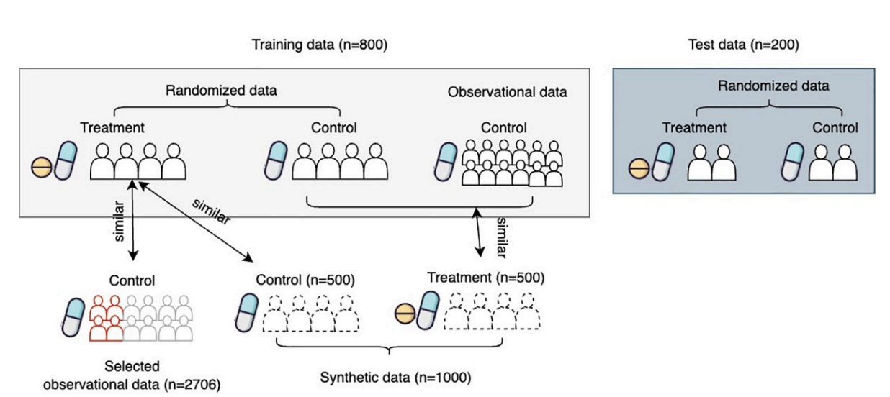

We have investigated counterfactual inference to identify causality among complicated variables observed in real-world patient data.

## Heterogeneous treatment effect estimation benchmark

Big data and (deep) machine learning have been ambitious tools in digital medicine, but these tools focus mainly on association. Intervention in medicine is about the causal effects. The average treatment effect has long been studied as a measure of causal effect, assuming that all populations have the same effect size. However, no “one-size-fits-all” treatment seems to work in some complex diseases. Treatment effects may vary by patient. Estimating heterogeneous treatment effects (HTE) may have a high impact on developing personalized treatment. Lots of advanced machine learning models for estimating HTE have emerged in recent years, but there has been limited translational research into the real-world healthcare domain. To fill the gap, we reviewed and compared eleven recent HTE estimation methodologies, including meta-learner, representation learning models, and tree-based models. We performed a comprehensive benchmark experiment based on nationwide healthcare claim data with application to Alzheimer’s disease drug repurposing. We provided some challenges and opportunities in HTE estimation analysis in the healthcare domain to close the gap between innovative HTE models and deployment to real-world healthcare problems.

📄 *Ling, Y., Upadhyaya, P., Chen, L., Jiang, X. and Kim, Y., 2023.* Emulate randomized clinical trials using heterogeneous treatment effect estimation for personalized treatments: Methodology review and benchmark. Journal of biomedical informatics, 137, p.104256.

## Patient cluster by counterfactual outcomes

Randomized Clinical trials (RCT) suffer from a high failure rate which could be caused by heterogeneous responses to treatment. Despite many models being developed to estimate heterogeneous treatment effects (HTE), there remains a lack of interpretable methods to identify responsive subgroups. This work aims to develop a framework to identify subgroups based on treatment effects that prioritize model interpretability. The proposed framework leverages an ensemble uplift tree method to generate descriptive decision rules that separate samples given estimated responses to the treatment. Subsequently, we select a complementary set of these decision rules and rank them using a sparse linear model. To address the trial’s limited sample size problem, we proposed a data augmentation strategy by borrowing control patients from external studies and generating synthetic data. We apply the proposed framework to a failed randomized clinical trial for investigating an intracerebral hemorrhage therapy plan. The Qini-scores show that the proposed data augmentation strategy plan can boost the model’s performance and the framework achieves greater interpretability by selecting complementary descriptive rules without compromising estimation quality. Our model derives clinically meaningful subgroups. Specifically, we find those patients with Diastolic Blood Pressure≥70 mm hg and Systolic Blood Pressure<215 mm hg benefit more from intensive blood pressure reduction therapy. The proposed interpretable HTE analysis framework offers a promising potential for extracting meaningful insight from RCTs with neutral treatment effects. By identifying responsive subgroups, our framework can contribute to developing personalized treatment strategies for patients more efficiently.

📄 *Ling, Y., Tariq, M.B., Tang, K., Aronowski, J., Fann, Y., Savitz, S.I., Jiang, X. and Kim, Y.,* An interpretable framework to identify responsive subgroups from clinical trials regarding treatment effects: Application to treatment of intracerebral hemorrhage. PLOS Digital Health, 3(5), p.e0000493. 2024

**Other publications**
- Upadhyaya P, Ling Y, Chen L, Kim Y, Jiang X. Inferring Personalized Treatment Effect of Antihypertensives on Alzheimer's Disease Using Deep Learning. Proc (IEEE Int Conf Healthc Inform). 2023 Jun;2023:49-57. doi: 10.1109/ichi57859.2023.00018. Epub 2023 Dec 11. PMID: 38516035; PMCID: PMC10956734.
- Kim, Y., Zhang, K., Savitz, S.I., Chen, L., Schulz, P.E. and Jiang, X., 2022. Counterfactual analysis of differential comorbidity risk factors in Alzheimer’s disease and related dementias. PLOS Digital Health, 1(3), p.e0000018.
- Upadhyaya, P., Zhang, K., Li, C., Jiang, X. and Kim, Y., 2023. Scalable causal structure learning: Scoping review of traditional and deep learning algorithms and new opportunities in biomedicine. JMIR Medical Informatics, 11(1), p.e38266.

