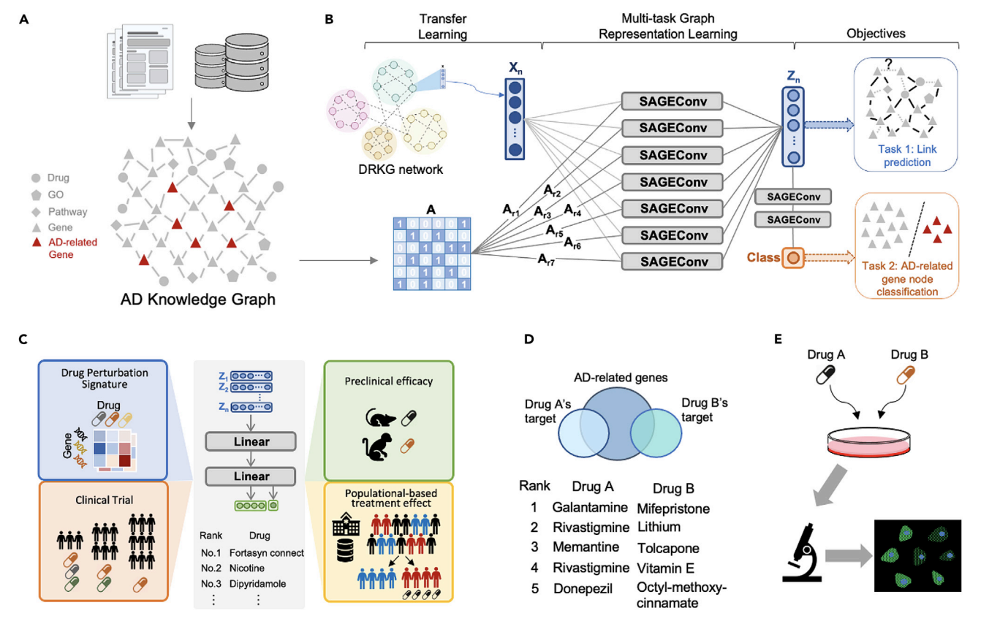
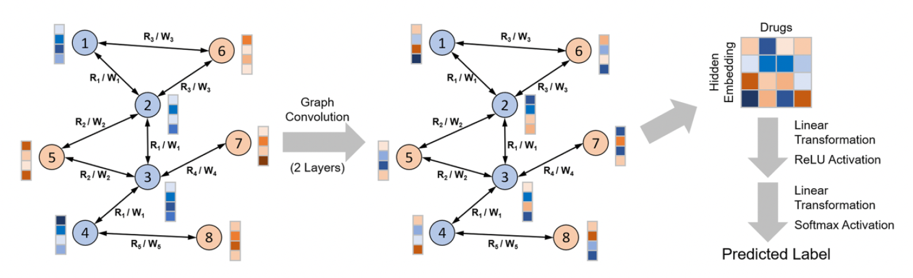
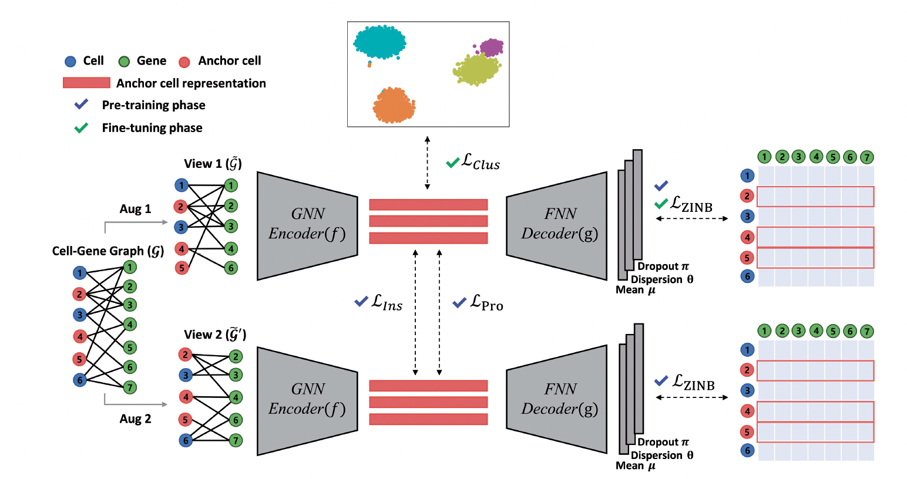

Our research focuses on leveraging **graph neural network** to represent complex biomedical graph and derive patterns for better understanding of our human biology. 

## Knowledge graph for drug repurposing

Our research focuses on developing advanced AI-driven frameworks for biomedical applications, particularly in drug repurposing. We employ deep learning and graph neural networks (GNNs) to systematically integrate multimodal biological knowledge, enabling efficient drug discovery across diverse diseases.

One study introduces a GNN-based pipeline for drug repurposing by constructing a comprehensive biomedical knowledge graph. This model learns complex interactions among drugs, genes, and phenotypes, prioritizing drug candidates based on in vitro efficacy, transcriptomic reversals, and population-based treatment effects. The integration of deep representation learning and transfer learning enhances model generalizability, supporting rapid and scalable drug discovery.

Another study applies multi-task deep learning to Alzheimer's disease drug repurposing, incorporating heterogeneous data sources such as human interactomes, transcriptomics, and clinical outcomes. The approach leverages multi-level evidence to rank candidates and predict synergistic drug combinations. Mechanistic validation in neuronal models further demonstrates its translational potential.

Our research underscores the power of AI/ML in harmonizing fragmented biomedical data, identifying therapeutic targets, and accelerating precision medicine. We seek PhD students and postdocs with expertise in machine learning, computational biology, and large-scale data integration to advance these methodologies for broader biomedical challenges.

**Selected publications**
- Hsieh, K., Wang, Y., Chen, L. et al. Drug repurposing for COVID-19 using graph neural network and harmonizing multiple evidence. Sci Rep 11, 23179 (2021). https://doi.org/10.1038/s41598-021-02353-5 (#citations >100)
- Hsieh, K.L., Plascencia-Villa, G., Lin, K.H., Perry, G., Jiang, X. and Kim, Y., 2023. Synthesize heterogeneous biological knowledge via representation learning for Alzheimer’s disease drug repurposing. Iscience, 26(1).
- Lin, K.H., Hsieh, K.L., Jiang, X. and Kim, Y., 2023. Integrating Comorbidity Knowledge for Alzheimer’s Disease Drug Repurposing using Multi-task Graph Neural Network. AMIA Summits on Translational Science Proceedings, 2023, p.378.

## Biological network

Our research focuses on leveraging advanced machine learning techniques to model biological networks for drug discovery and biomedical applications. We integrate deep learning, graph neural networks (GNNs), and contrastive learning to analyze complex molecular interactions, enhancing drug repurposing, single-cell transcriptomics, and blood-brain barrier (BBB) permeability prediction. Our work employs relational graph convolutional networks (RGCNs) to capture drug-protein interactions, aiding in the identification of therapeutics that penetrate the BBB. We also develop contrastive learning frameworks to cluster single-cell RNA sequencing data, overcoming challenges in cellular heterogeneity. Furthermore, we construct large-scale biomedical knowledge graphs to prioritize drug candidates based on multimodal evidence, from molecular interactions to population-based outcomes. Our approach unifies network biology and deep learning, providing scalable, generalizable models that advance precision medicine. We seek computational researchers to further innovate in AI-driven modeling of biological systems and therapeutic discovery.

**Selected publications**
- Lee, J., Kim, S., Hyun, D., Lee, N., Kim, Y. and Park, C., 2023. Deep single-cell RNA-seq data clustering with graph prototypical contrastive learning. Bioinformatics, 39(6), p.btad342. (**Cell-gene network**)
- Ding, Y., Jiang, X. and Kim, Y., 2022. Relational graph convolutional networks for predicting blood–brain barrier penetration of drug molecules. Bioinformatics, 38(10), pp.2826-2831. (**Protein-protein network**)
- Huang T, Lin KH, Machado-Vieira R, Soares JC, Jiang X, Kim Y. Explainable drug side effect prediction via biologically informed graph neural network. medRxiv [Preprint]. 2023 Jun 5:2023.05.26.23290615. doi: 10.1101/2023.05.26.23290615. PMID: 37333107; PMCID: PMC10275013. (**Drug-protein network**)
- Turnbull, A., Kim, Y., Zhang, K., Jiang, X., He, Z., Henderson, V.W. and Lin, F.V., 2024. Age-associated proteins explain the role of medial temporal lobe networks in Alzheimer’s disease. GeroScience, pp.1-15. (**Brain network**)
