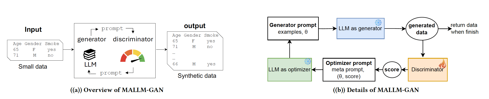
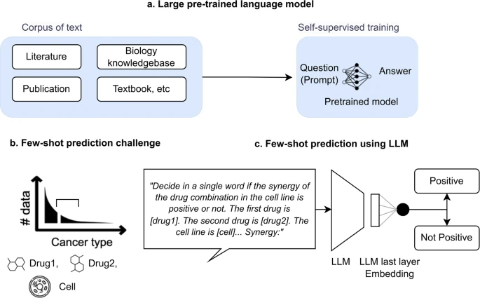

# LLM for Scientific Discovery

Our research focuses on leveraging **Large Language Models (LLMs)** to drive scientific discovery, particularly in data-scarce environments. Below are two key projects that illustrate how LLMs can revolutionize **synthetic data generation** and **drug synergy prediction** in healthcare.

---

## 🔹 Synthetic Tabular Data Generation with LLMs
### MALLM-GAN: AI-Driven Data Synthesis
📄 [**Multi-Agent Large Language Model as Generative Adversarial Network for Synthesizing Tabular Data**](https://arxiv.org/pdf/2406.10521)  
✍️ *Yaobin Ling, Xiaoqian Jiang, and Yejin Kim*

In many fields, particularly healthcare, data is a valuable yet limited resource. Privacy concerns, costs, and accessibility barriers often mean that researchers have only small datasets to work with, making it difficult to train advanced machine learning models. Our team has developed **MALLM-GAN**, an innovative AI framework that leverages **large language models (LLMs)** to generate **realistic synthetic data** from limited real-world examples.  

Traditional methods for synthetic data generation often require large datasets for training, which contradicts the goal of solving data scarcity. In contrast, MALLM-GAN mimics the **Generative Adversarial Network (GAN)** approach but replaces deep learning models with LLMs that learn patterns through text-based instructions. By iteratively refining a **data generation process** using AI, our approach produces high-quality, privacy-preserving synthetic datasets that can be used for medical research and other sensitive domains.  

Our experiments show that MALLM-GAN outperforms existing synthetic data generation models, particularly when data is scarce. This means researchers can now **generate reliable data** even in situations where collecting real data is impractical. Ultimately, this work brings AI one step closer to **democratizing data access**, ensuring that critical research is not hindered by data limitations.  

---

## 🔹 Few-Shot Drug Synergy Prediction
### CancerGPT: AI for Drug Discovery
📄 [**CancerGPT: Few-Shot Drug Pair Synergy Prediction Using Large Pretrained Language Models**](https://www.nature.com/articles/s41746-024-01024-9)  
🏆 *Top 10 Most Cited Paper in 2024 in npj Digital Medicine*  
✍️ *Tianhao Li, Sandesh Shetty, Advaith Kamath, Ajay Jaiswal, Xiaoqian Jiang, Ying Ding, and Yejin Kim*

The development of new cancer treatments is often hindered by limited data, particularly for rare cancer types. Traditional machine learning models require large datasets to predict how drugs interact, making it difficult to explore new drug combinations in understudied cancers. Our team has developed CancerGPT, an artificial intelligence model that uses large language models (LLMs) to predict the effectiveness of drug combinations, even with very little or no training data.

By leveraging knowledge from vast amounts of scientific literature, CancerGPT can make accurate predictions in rare cancer types where experimental data is scarce. Unlike conventional machine learning approaches, which rely on structured datasets, our model extracts valuable insights from text-based medical research. This allows it to predict drug synergies—situations where two drugs work better together than alone—without requiring extensive lab experiments.

Our results show that CancerGPT achieves comparable accuracy to much larger AI models, making it a cost-effective and scalable tool for drug discovery. This breakthrough paves the way for using AI to accelerate cancer research, enabling scientists to test promising drug combinations more efficiently and improve treatment options for patients with rare cancers.

---

